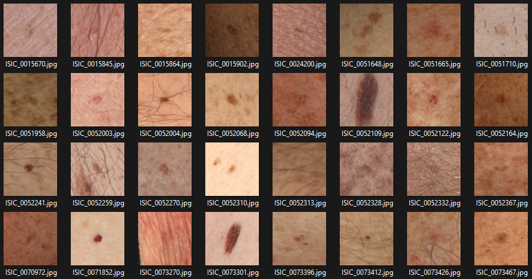

# Skin Cancer Detection Project

## Authors

Sergio Sanz  
Mila Miletic  

## Overview

This project belongs to a Kaggle competition on [ISIC 2024 - Skin Cancer Detection with 3D-TBP](https://www.kaggle.com/competitions/isic-2024-challenge/overview), in which the submission deadline was on Friday, September 6 2024.

This project focuses on the development of machine learning (ML) and deep learning (DL) algorithms to identify histologically confirm skin cancer cases with single-lesion crops from body images. In addition to the image database, a comprehensive set of metadata information related to the lesion is provided. For more information about the metadata features, please visit the aforementioned link. By using all this information, the goal of this challenge is to build, test, and evaluate a binary classification system that combines image-based deep learning neural networks with advanced machine learning models to identify whether the sample correspond to a benign or a malignant case. 

## Description (from Kaggle Website)
Skin cancer can be deadly if not caught early, but many populations lack specialized dermatologic care. Over the past several years, dermoscopy-based AI algorithms have been shown to benefit clinicians in diagnosing melanoma, basal cell, and squamous cell carcinoma. However, determining which individuals should see a clinician in the first place has great potential impact. Triaging applications have a significant potential to benefit underserved populations and improve early skin cancer detection, the key factor in long-term patient outcomes.

Dermatoscope images reveal morphologic features not visible to the naked eye, but these images are typically only captured in dermatology clinics. Algorithms that benefit people in primary care or non-clinical settings must be adept to evaluating lower quality images. This competition leverages 3D TBP to present a novel dataset of every single lesion from thousands of patients across three continents with images resembling cell phone photos.

This competition aims to develop AI algorithms that differentiate histologically-confirmed malignant skin lesions from benign lesions on a patient. This work will help to improve early diagnosis and disease prognosis by extending the benefits of automated skin cancer detection to a broader population and settings.

## Evaluation Metric

The metric that has been used in the project is the [partial area under the ROC curve](https://en.wikipedia.org/wiki/Partial_Area_Under_the_ROC_Curve) (pAUC) above 80% true positive rate (TPR) for binary classification of malignant examples. (See the implementation in the notebook [ISIC pAUC-aboveTPR](https://www.kaggle.com/code/metric/isic-pauc-abovetpr).)

## Challenges

Apart from the magnitude of its complexity, the main challenge of this project is working with an extremely imbalanced dataset. Specifically, the database includes about 400 malignant cases versus 400,000 benign cases, 1,000 more benign cases than malignant lesions.

Another key aspect to highlight is that there is no feature in the metadata that is highly correlated with the target. An in-depth analysis of the metadata, as well as a lot of feature engineering effort, is required to obtain very good partial AUC scores. Therefore, the machine learning models proposed in this project are fed with a large number of features, most of which have been re-generated from the original ones.

## Proposed Machine Learning Architecture (Submited to Kaggle)

Fixme.

## Description of the Notebooks

Fixme.

